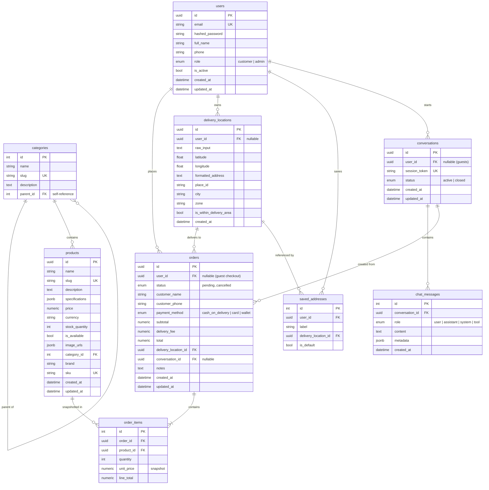

# Entity Relationship Diagram

Notes:

- Prices/totals are `NUMERIC(10,2)`; the API serializes them as decimal strings.
- `order_items.unit_price` is a snapshot at purchase time; later price changes do not affect past orders.
- JSONB columns fall back to plain JSON on SQLite (tests only).
- Migrations live in `alembic/versions` and are append-only.
